# Natural-Language-Processing-with-Disaster-Tweets
[ Kaggle competition Link](https://www.kaggle.com/c/nlp-getting-started/overview)
It is my first Natural Language Processing competition on Kaggle I took part in Using logistic regression with BOWs model the  test accuracy is 77.03% and with Tf-Idf the test accuracy is 76.38% and using Embedding and LSTM Recurrent Neural Network test accuracy is 98%
## Competition Description
Twitter has become an important communication channel in times of emergency.
The ubiquitousness of smartphones enables people to announce an emergency they’re observing in real-time. Because of this, more agencies are interested in programmatically monitoring Twitter (i.e. disaster relief organizations and news agencies). 

in this competition, you’re challenged to build a machine learning model that predicts which Tweets are about real disasters and which one’s aren’t. You’ll have access to a dataset of 10,000 tweets that were hand classified

## Data Content:
* id - a unique identifier for each tweet
* text - the text of the tweet
* location - the location the tweet was sent from (may be blank)
* keyword - a particular keyword from the tweet (may be blank)
* target - in train.csv only, this denotes whether a tweet is about a real disaster (1) or not (0)

## EDA
Below are a few highlights from the Exploratory Data Analysis
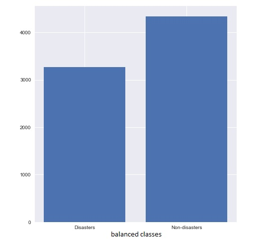
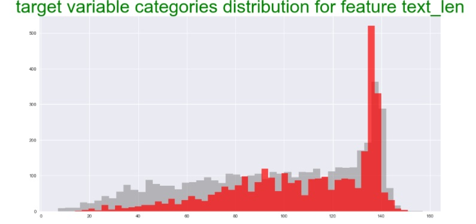
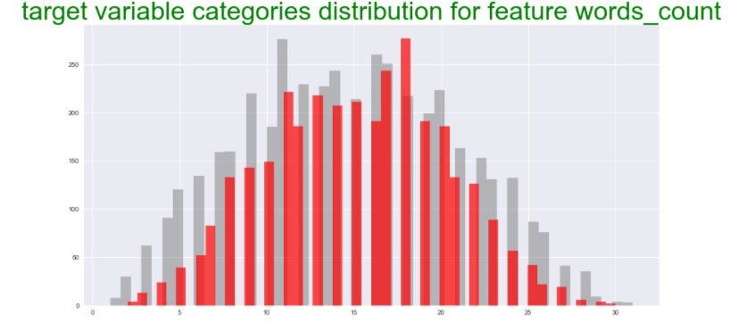
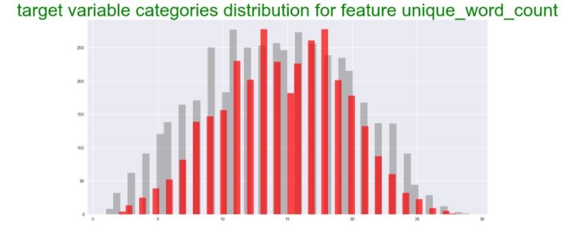
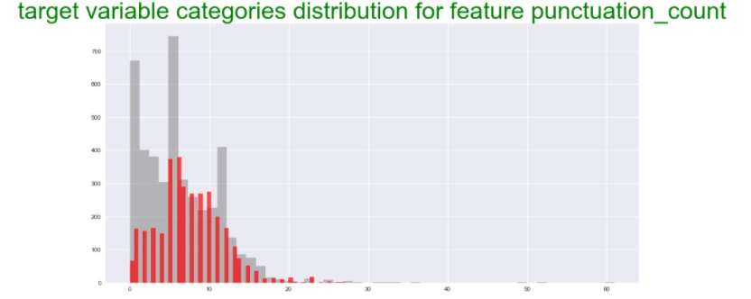
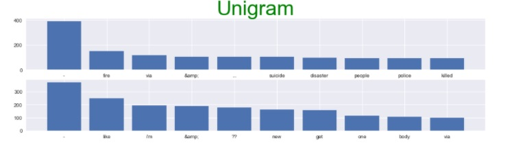
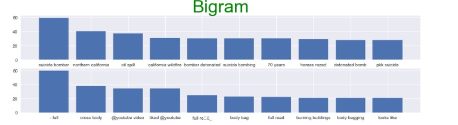
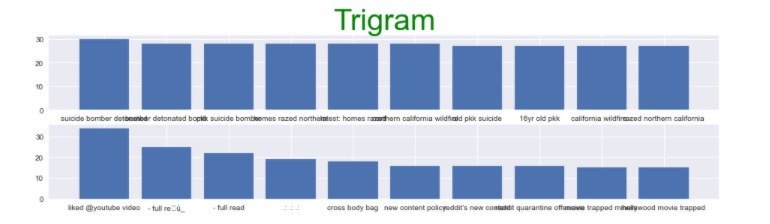
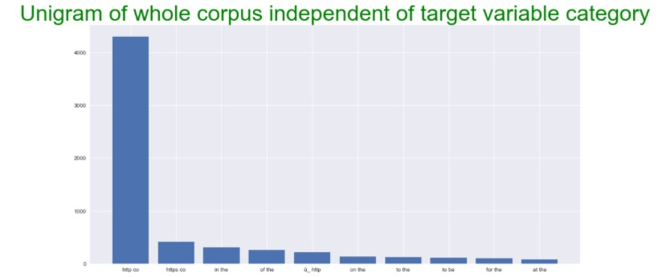
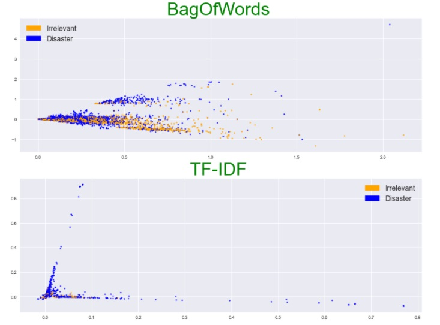
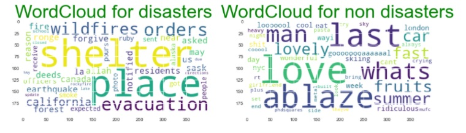
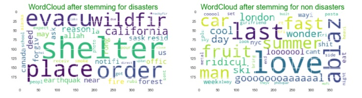

## Model Building
* Logistic Regression with Bag-of-words model
 
* Logistic Regression with TF-IDF model

*Embedding and LSTM Recurrent Neural Network

 
## Model performance
* Logistic Regression with Bag-of-words Model Model Score: 77.03 %
* Logistic Regression with TF-IDF model Model Score: 76.38 %
* Embedding and LSTM Recurrent Neural Network Model Score: 98.16%

## Acknowledgments
This dataset was created by the company figure-eight and originally shared on their ‘Data For Everyone’ website here.

Tweet source: https://twitter.com/AnyOtherAnnaK/status/629195955506708480
